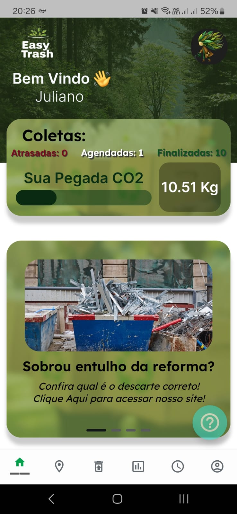
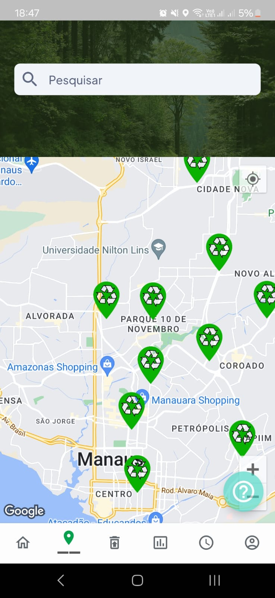
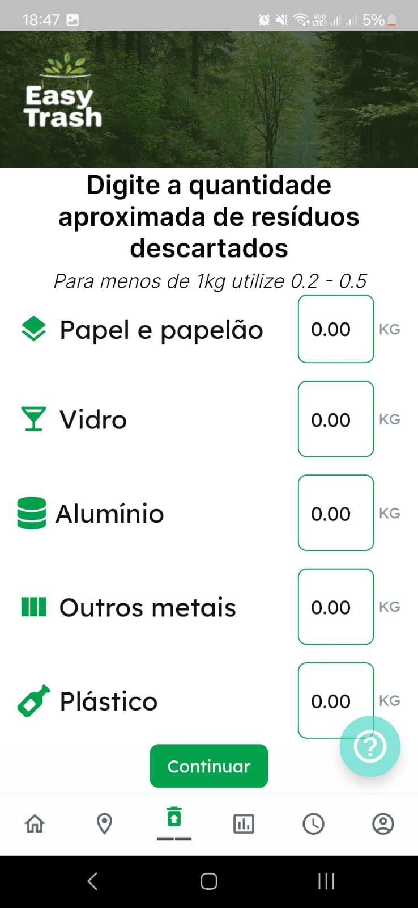
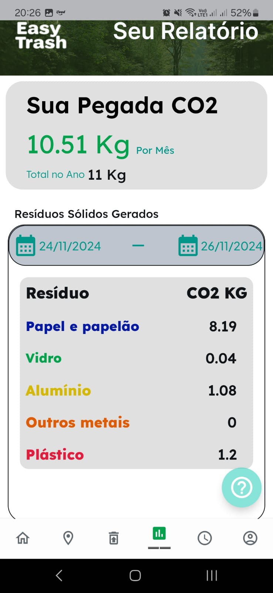
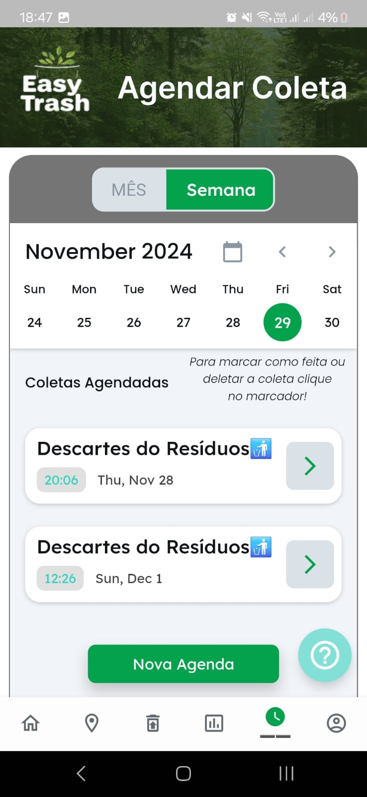

# Gestão de Resídos Easy Trash

<!---->

   

> O objetivo do aplicativo é fornecer uma ferramenta simples e eficiente para gestão de resíduos sólidos, permitindo que os usuários acompanhem sua pegada de carbono e contribuam de forma ativa com o meio ambiente.

## 1. Como Foi Desenvolvido?

•	O aplicativo foi desenvolvido utilizando o framework Flutter, que utiliza a linguagem de programação Dart, a API Google Maps foi utilizada para exibir os pontos de coleta no mapa, e um banco de dados também da google (Firebase) foi usada para armazenar as informações sobre as coletas e a pegada de carbono do usuário.

## 2. Quais as funcionalidades do app?

As funcionalidades principais incluem o acompanhamento de coletas de resíduos, a visualização de pontos de coleta próximos no mapa, o cálculo da pegada de carbono baseado nos resíduos descartados e a possibilidade de agendar notificações de coleta.

  
  
  
  
  

## 💻 Pré-requisitos

Antes de começar, verifique se você atendeu aos seguintes requisitos:

- Você instalou a versão mais recente de <Dart / Flutter>
- Certifique-se que tenha uma api do Firebase e do google maps.

## ☕ Usando o Easy Trash

Você pode baixar o apk do aplicativo para testes. 

   

ou [Clique aqui!](https://github.com/WalterGoncalves-filho/Gestao-de-Residuos-app/tree/30484e5b38f6dacb640c89b529d56b1b873c5a93/Apk)

## 📝 Licença

Esse projeto está sob licença. Veja o arquivo [LICENÇA](LICENSE.md) para mais detalhes.
